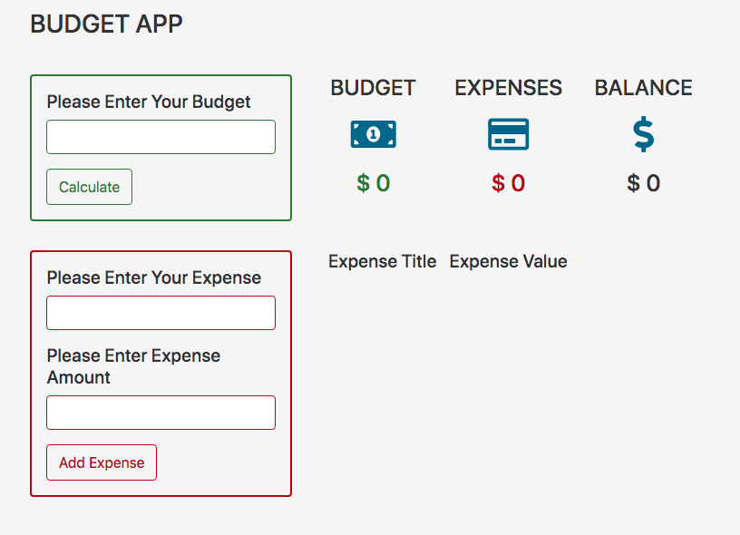
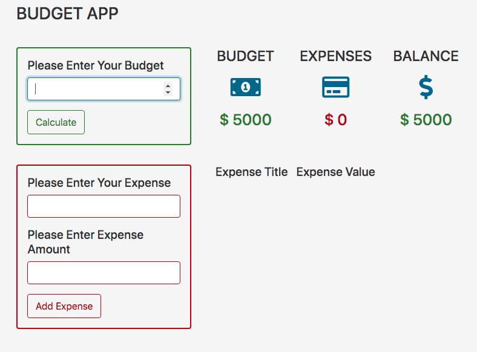
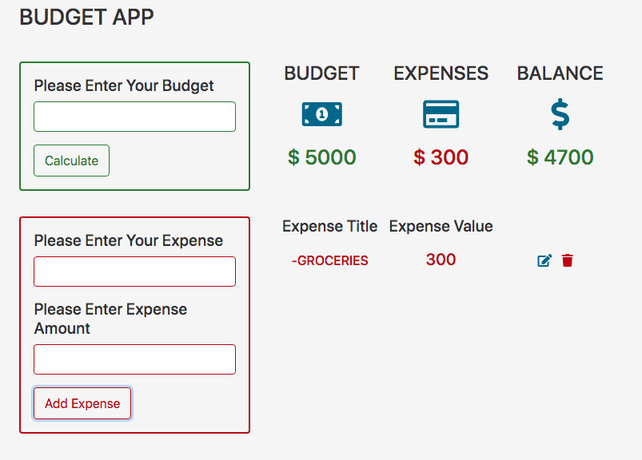
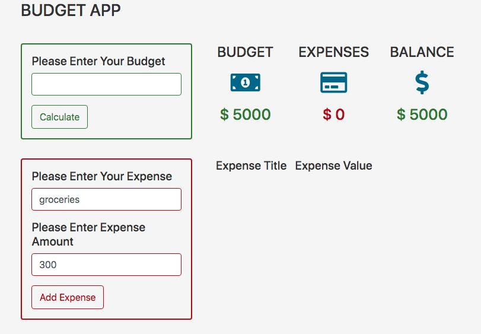
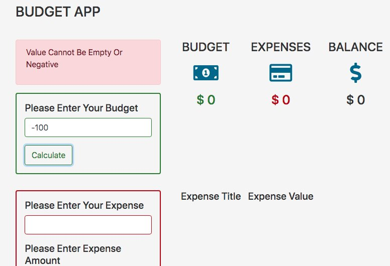

Project created to practice javascript, css and html.

The page looks like this:

you can add your budget

you can add your expense with a description

you can edit the name or the amount of your expense

negative or zero values ​​cannot be added

